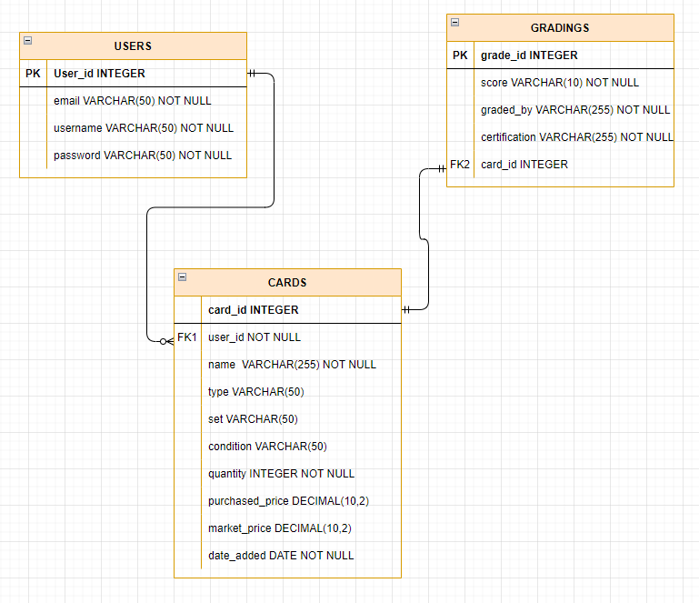
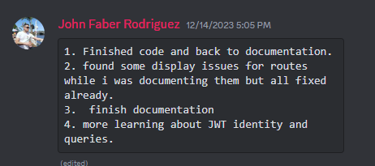
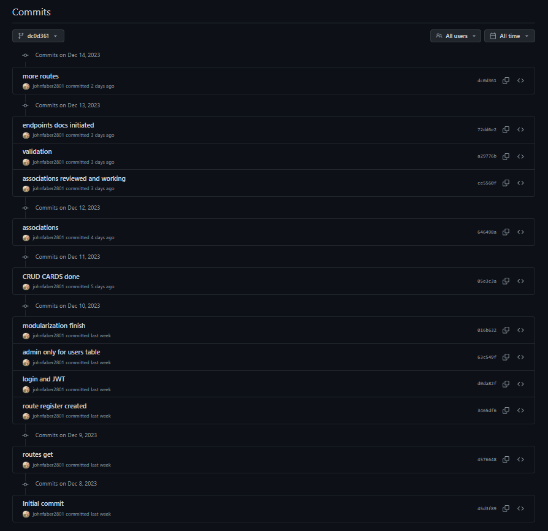

# Pokemon Card Tracker Web Server API Documentation

## [Github repository](https://github.com/johnfaber2801/API__server)

## [Github Project board](https://github.com/users/johnfaber2801/projects/3/views/1?layout=roadmap)

## [ERD](#an-erd-for-your-app)


## R1 and R2 Problem Identification and Justification

Problem to solve with the Pokémon Card Tracker is to provide collectors with a tracker for managing and organizing their collections. Collectors face challenges in keeping track of their items, especially in keeping with details such as type, rarity, set, condition, quantity, purchased price, market price, and grading for each card.
Collectors struggle to organize and manage their collections efficiently, particularly when dealing with many items. The tracker provides an organized way to input, store, and update information about each card.
Collectors value the privacy and security of their collections, especially if they own rare or valuable items. By requiring user accounts, the tracker ensures that each collector's data is private and can only be accessed by the account owner.
Offering features such as adding, viewing, updating, and removing cards encourages user engagement. The tracker provides a dynamic and interactive platform for collectors to enthusiastically manage and enjoy their hobby and enhance the overall experience of collecting by providing a secure, accessible, and user-friendly solution for managing Pokémon card collections.

## R3 Justification of the Database System

The Pokémon Card Project relies on PostgreSQL, a Relational Database Management System (RDBMS) and object-relational database system following the relational model. In this model data in the database is structured in tables, each table has rows and columns, rows contain records or data instances, and columns or attributes define the properties of the data stores in the table. Tables contain primary and foreign keys; primary key refers to a unique identifier in a table that ensures no duplication of rows, foreign keys establish a link between two tables, the foreign key in one table corresponds to the primary key in another. (Grosu. A,2023) (S. Elizabeth, 2023)
This relational database suits the project as data can be carefully organized into tables with well-defined relationships, for example, an user can have one or many Pokémon cards (one to many), also it complies with ACID (Atomicity, Consistency, Isolation, Durability), ensuring data integrity and consistency even in the situation of failures. (Grosu. A,2023)
Data stored in Pokemon_db has a consistent structure and has clear relationships such as the relationship between user, cards, and grading. In addition, domain integrity is achieved through primary and foreign keys, normalisation, and data validation rules.
The decision to leverage PostgreSQL aligns with the goal of making the Pokémon Card Project accessible to a wide audience of collectors, including those who may be entering the hobby with limited financial resources. By using an open-source RDBMS like PostgreSQL, the project aspires encourage a community to collecting and sharing information about Pokémon cards.

### Drawbacks

Drawbacks of PostgreSQL include slower query processing over terabytes of data. In comparison to NoSQL databases as Cassandra, where flexible schemas enable querying with only the necessary attributes, PostgreSQL has established schemas. This means that a query must navigate the entire schema, leading to higher processing times. (Hevo Data Inc, 2022).
Scalability will be another drawback in the scenario where PostgreSQL have incoming data in very high volumes as RDMS are built with one server and scale only will be vertically by increasing capacity with CPU, RAM, or storage. Cassandra scale horizontally, facilitating addition of serves or nodes to increase load. Horizontal scaling is faster and cheaper than vertical scaling. (Hevo Data Inc, 2022).
Cassandra schemas are flexible, its dynamic data structure facilitates the addition of new fields without schema migrations. PostgreSQL is stricter, requiring schemas migrations for new fields. (DataStax, 2023)
Cassandra shines at handling large volumes of unstructured or semi-structured data, particularly in terms of write throughput and scalability. PostgreSQL drawback handling large volumes of unstructured or semi-structured data can impact query performance. (DataStax, 2023)
PostgreSQL benefits of full ACID transaction support, ensuring data consistency and integrity. Cassandra supports lightweight transactions, but it's not designed for applications requiring strong ACID guarantees. For applications requirements of a strict transactional consistency, PostgreSQL is a better choice for our application. ( DataStax, 2023)

## R4 Identify and discuss the key functionalities and benefits of an ORM

Object-relational mapper (ORM) brings an object-oriented layer between relational databases and object-oriented programming (OOP) without having to write SQL queries. OOP uses objects within classes to model and organize code, and relational databases organize data into tables with rows and columns. This project will utilize SQLAlchemy, a widely adopted Python SQL toolkit and ORM, offering application developers comprehensive control and adaptability relating to SQL functionality. (Liang, 2021).
The advantages of using an ORM lies in productivity, achieved through the simplification of database interactions. By employing Python objects and methods, developers can perform operations on the database without the need to write SQL queries directly. Built-in CRUD methods further enhance this efficiency, streamlining the process of managing Pokemon cards within the tracker. Entities (user, cards, purchases) are represented as python objects, The ORM leverages relationships to establish connections and associations between these entities, facilitating the coherent representation and interaction of data. (Liang, 2021).
Another benefit of ORMs is the facilitation of unit testing. Since the ORM code is fully tested, developers can concentrate more on ensuring the achievement of the business logic rather than constantly modifying database operations and testing data-access code. Another advantage of ORMs is migrations, involve managing changes to the database schema over time while preserving existing data, which its ideal whether the project evolve or not. (Liang, 2021) (Barnse,2007)
ORMs offers Schema management that helps defining structure and organization of the database. where developers define the data model in code, and the ORM system generates the corresponding database schema. Additionally, ORM integrates with version control systems, ensuring that changes to the ORM are effectively tracked. This integration facilitates collaboration and ability to roll back changes when necessary. (Barnse,2007)

## R5 Document all endpoints for your API

1. /register

- HTTP Request Verb: **POST**

- Required data: email, username, password

- Expected JSON response Data: Expected '201 CREATED' response with return of data excluding 'password','id','cards',and 'is_admin'.

- Authentication methods: Bcrypt will hash the password and store the hashed password in the database.

- Description: Allows new users to register. Details will be stored in the database.


2. /Login user

- HTTP method: **POST**

- Required data: email, password

- Expected JSON response Data: Expected '200 OK' response with return of data including JWT token, user: email, user_id, and username.

- Authentication methods: email, password mandatory fields, bcrypt will match the password enterred with the password in database, jwt will create a JWT access token attached to the logged in user.

- Description: Allows users to login. in order to add, view, update, and delete pokemon cards.


3. /Create a Pokemon Card

- HTTP method: **POST**

- Required data: name(nullable= False), type(nullable= False), set, condition(nullable= False), quantity(nullable= False), purchased_price, market_price. The default value is null for the rest.

- Expected JSON response data: Expected '201 CREATED' response with return of data including pokemon card details.

- Authentication methods: JWT (required and identity) in order to create a new Pokemon Card with user_id assigned accordignly.

- Description: Allows existing users to add a new Pokemon Card. Details will be stored in the database.


4./ add grading to an existing Pokemon Card

- HTTP method: **POST**

- Required data: score, graded_by, certification

- Expected JSON response data: Expected '201 CREATED' response with return of data including pokemon card name, certification, graded_by, grading_id, and score.

- Authentication methods: JWT (required and identity) to create a grading for an existing Pokemon Card of the user.

- Description: Allow users to add grading details to an existing Pokemon Card if required.


5. / update details in a existing Pokemon Card

- HTTP method: **PUT, PATCH**

- Required data: card_id 

- Expected JSON response data: Expected '200 OK' response. JSON response is the card of the user with all information including updated information.

- Authentication methods: JWT token to update cards owned by the user. otherwise the user will be prompted with error message.

- Description: Allow users to update cards owned by the user


6. / get all cards from user

- HTTP method: **GET**

- Required data: NONE

- Excepted JSON response data: Expected ' 200 ok' response. JSON response will display all cards owned by the user.

- Authentication method: JWT token, JWT identity.

- Description: Allow users to display cards owned by the user.


7. /get all gradings user

- HTTP method: **GET**

- Required data: NONE

- Expected JSON response: Excpted '200 OK' response. JSON response will display grading details for each pokemon card.

- Authentication method: JWT token, JWT identity

- Description: Allow users to retrieve gradings for existing cards.


8./ get only one grading

- HTTP method: **GET**

- Required data: grading id

- Expected JSON response: Expected '200 ok' response. JSON response will display the grading details of specified grading.

- Authentication method: JWT token , JWT identity, and grading id

- Description: Allows access to an specific grading details of a card.


9. / update one grading

- HTTP METHOD: **PUT**

- Required data: grading id

- Expected JSON response: Expected '200 OK' response. JSON will display the grading details with new updates.

- Authentication Method: JWT token, JWT identity

- Description:Allows updating of grading details for an existing grading.


10. / Admin get all users with their cards

- HTTP METHOD: **GET**

- Required data: none

- Excpeted JSON response: Expected '200 ok" response. JSON will display all users with their information with their cards.

- Authentication method: Admin JWT token

-  Description: admin retrieves information from all users with their cards details.


11. / Admin get all gradings from all users

- HTTP METHOD: **GET**

- required data: none

- Excpeted JSON response: Expected '200 ok" response. JSON will display all gradings with their information with only the name of the card.

- Authentication method: Admin JWT token

- Description: admin retrieves information from all gradingsfrom all users.


12. / admin deletes an user 

- HTTP METHOD: **DELETE**

- required data: user id

- Excpeted JSON response: Expected '200 ok" response. JSON will display a message of success in deletion of users and associated cards.

- Authentication method: Admin JWT token

- Description: admin deletes user and associated cards


13. / User deletes a grading

- HTTP METHOD: **DELETE**

- required data: grading id

- Excpeted JSON response: Expected '200 ok" response. JSON will display a message of success in deletion of grading

- Authentication method: user JWT token

- Description: user deletes only one specific grading.


14. / User deletes a grading

- HTTP METHOD: **DELETE**

- required data: card id

- Excpeted JSON response: Expected '200 ok" response. JSON will display a message of success in deletion of pokemon card

- Authentication method: user JWT token 

- Description: user deletes only one specific grading.


## R6 An ERD for your app

The application's Entity Relationship Diagram (ERD) comprises three entities: users, cards, and gradings. Here are the key relations and attributes for each entity:

1. Users-Cards Relation:
Users can possess zero or many cards.
Each card is associated with only one user.

2. Cards-Grading Relation:
Cards can have only one grading or none.
Each grading is associated with only one card.




## R7 Detail any third party services that your app will use

1.	**Bcrypt**

Bcrypt is a password hashing algorithm designed by Niels Provos and David Mazières based on the Blowfish cipher. Bcrypt is one of the most secure passwords hashing algorithms available, and it is widely used in web applications and other software that stores passwords. (Bcrypt)

2.	**Flask**
It is a web framework written in python. Very popular choice for web developing and APIs thanks to his simple design and usability. Flask is categorized within microframeworks, providing essential web development components without enforcing a rigid structure or excessive features. (Gringberg,2023)

3.	**JWT Manager**
A JWT (JSON Web Token) Manager is a component or library that facilitates the creation, encoding, decoding, and verification of JWTs in the context of web application development. JWT is commonly used for authentication and information exchange in stateless, distributed systems.

4.	**Marshmallow**
Marshmallow is a data serialization library that facilitates the conversion of complex data structures into simpler data formats like JSON or Python dictionaries. It simplifies data handling for web applications by streamlining the process of sending and receiving data between the application and the client. (Marshmallow,2023)

5.	**Psycopg2**
Psycopg2 simplifies the process of connecting to, establishing, and managing PostgreSQL databases. It serves as a PostgreSQL client interface, enabling developers to execute SQL queries, retrieve data, and manage database operations.

6.	**PostgreSQL**
Relational Database Management System (RDBMS) and object-relational database system following the relational model. It features inheritance and polymorphism. This makes it possible to model complex data relationships and behaviour more effectively. (Grosu. A,2023)

7.	**SQL Alchemy**
SQLAlchemy is a Python SQL toolkit and object-relational mapper (ORM). It allows to access and manage SQL databases using a Pythonic domain language, without having to write raw SQL queries. (SQLAlchemy,2023)


## R8 Describe your projects models in terms of the relationships they have with each other

User model represents users in the database, and it establishes an one-to-many relationship with the Card model, allowing each user to be associated with multiple cards. The 'delete-orphan' option ensures that orphaned Card records are deleted.

```python
class User(db.Model):
   
    __tablename__= "users"

    id = db.Column(db.Integer,primary_key=True)

    email = db.Column(db.String, nullable=False, unique=True)
    username = db.Column(db.String, nullable=False, unique=True)
    password = db.Column(db.String, nullable=False)
    is_admin = db.Column(db.Boolean, default=False)

    cards = db.relationship('Card', back_populates='user',  cascade='all, delete-orphan')
```

Card model represents information about Pokémon cards and establishes relationships with both the User and Grading models. user_id attribute is a foreign key that establishes a many-to-one relationship between the Card and User models. The user attribute provides a way to access the user associated with a particular card, and the grading attribute provides a way to access grading information associated with a card.  The 'delete-orphan' option ensures that orphaned Grading records are deleted.

```python
class Card(db.Model):
    __tablename__= "cards"

    id = db.Column(db.Integer,primary_key=True)

    name = db.Column(db.String(), nullable= False)
    type = db.Column(db.String(), nullable= False)
    set = db.Column(db.String())
    condition= db.Column(db.String(), nullable= False)
    quantity = db.Column(db.Integer(), nullable= False)
    purchased_price = db.Column(db.Integer())
    market_price = db.Column(db.Integer())
    date = db.Column(db.Date(), default=datetime.now().strftime('%Y-%m-%d'))

    user_id = db.Column(db.Integer,db.ForeignKey('users.id'), nullable=False)
    user = db.relationship('User', back_populates= 'cards')
                           
    grading = db.relationship('Grading', back_populates='card',  cascade='all, delete-orphan')
```

the Grading model represents information about the grading of Pokémon cards and establishes a many-to-one relationship with the Card model. The card attribute provides a way to access the card associated with a particular grading.

```python

class Grading(db.Model):

    __tablename__= "gradings"
   
    id = db.Column(db.Integer,primary_key=True)
   
    score = db.Column(db.String(), nullable=False)
    graded_by = db.Column(db.String(), nullable=False)
    certification = db.Column(db.String(), nullable=False)

    card_id = db.Column(db.Integer, db.ForeignKey('cards.id'), nullable=False)
    card = db.relationship('Card', back_populates='grading')
```

The three models create a relational structure where users can be associated with multiple cards, each card can have multiple gradings, and each grading is linked to a specific card.


## R9 Discuss the database relations to be implemented in your application

This project used a database named **'pokemon_db'**, it was created in PostgreSQL, and contains 3 tables users, cards, and gradings.

The **User** table includes four attributes: email, username, password, and is_admin. All attributes except is_admin are marked as NOT NULL, preventing the registration of duplicate users. This configuration ensures authentication and uniqueness for each account. An admin account has been established to control over the database, managing user accounts and their collections.The table serves as the primary table for user-related data.

The **cards** table contains eight attributes: name, type, description, set, quantity,purcharsed_price, market_price, currency,and date. Among them, only four attributes (name, type, condition, quantity) are designated as NOT NULL, prioritizing the essential characteristics of Pokémon cards. The table establishes a foreign key linking to the primary table (users), ensuring that every card is associated with an owner. This relationship enforces the condition that a card can only be created if a corresponding user exists. In addition, the attributes **type** and **condition** are subject to validation using predefined lists( ```python type = fields.String(validate=OneOf(VALID_POKEMON_TYPES))```,```python condition = fields.String(validate=OneOf(VALID_CARD_CONDITION_TYPES))```) in order to add data consistency to the table  predefining Pokémon card types and condition types.

the **gradigns** table contains three attributes: score, graded_by, and certification. All atributes are marked NOT NULL to avoid duplicates.This table holds the most valuable information as single cards could 10x on price once graded, it makes them very tradeable and very often treated as investments. This table contains a foreign key to the cards table, it enforces the condition that a grading can only be created if a corresponding card exists. In addition, the attribute **graded_by** is subject to validation using a predefined list ```pythongraded_by = fields.String(validate=OneOf(VALID_GRADING_COMPANIES))```, in order to add data consistency to the table predefining grading compnay information.

The relationships between tables enforce ownership, association, and data consistency, demonstrating a foundation for managing user accounts, Pokémon cards, and valuable grading information.


## R10 Describe the way tasks are allocated and tracked in your project

The API server project was tracked using **GitHub Projects**, this project management tool allowed me to manage tasks for 2 weeks in a very organized way. Tasks were categorized in the "Todo" section, enabling planning for both documentation and code. The initial tasks were moved to the "In Progress" section, indicating active work, and subsequently to the "Done" section upon completion.

The code implementation phase, being the most time-consuming, was strategically divided into manageable pieces. This approach granted me control and organization, allowing for a successful API development without starting from the endpoint.

The time management was greatly handled, balancing academic commitments and work responsibilities, played a crucial role. I was able to assign tasks per day to be as efficient as possible. During my days off I got the most of the tasks done. Find below a screenshot of the timeline that illustrates peak productivity during these dedicated periods.


Additionally, in the Coder Academy Discord, I regularly provided daily work progress updates in the #Standups section. While the project was undertaken individually, the collective posting within the channel provided a sense of work as a group , offering valuable insights and collaboration opportunities.




Finally, the project was executed using GitHub for version control. I tracked my progress through Git commits, managed my main branch to facilitate development, and revisited the main codebase for updates.

